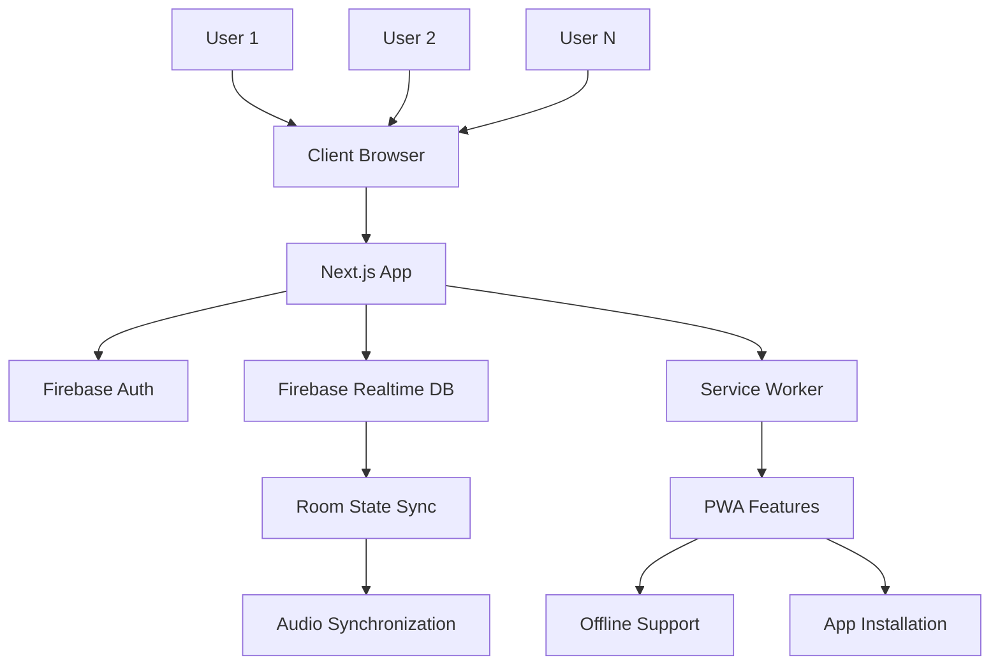

# Design Document

## Overview

The Sync Music Player is a Progressive Web Application built with Next.js 16, React 19, Material UI 7, and Firebase 12. The application enables real-time synchronized music playback across multiple users in virtual rooms. The architecture follows a client-side state management pattern with Firebase Realtime Database providing the synchronization layer.

The existing codebase already has basic music synchronization functionality implemented, which will be extended to include full authentication, room management, and PWA capabilities.

## Architecture

### High-Level Architecture



### Technology Stack

- **Frontend Framework**: Next.js 16 with React 19
- **UI Library**: Material UI 7 (@mui/material, @mui/icons-material)
- **Authentication**: Firebase Authentication
- **Database**: Firebase Realtime Database
- **State Management**: React hooks with Firebase real-time listeners
- **PWA**: Service Worker + Web App Manifest
- **Styling**: Emotion (built into MUI)

### Data Flow

1. **Authentication Flow**: User authenticates → Firebase Auth → User data stored in Realtime DB
2. **Room Creation Flow**: User creates room → Room data stored in DB → Room ID generated
3. **Room Joining Flow**: User joins via ID → Membership updated in DB → Real-time sync established
4. **Music Sync Flow**: User action → DB update → All clients receive update → Audio players sync

## Components and Interfaces

### Core Components Structure

```
src/
├── app/
│   ├── components/
│   │   ├── auth/
│   │   │   ├── AuthProvider.js
│   │   │   ├── LoginForm.js
│   │   │   └── ProtectedRoute.js
│   │   ├── room/
│   │   │   ├── RoomCreator.js
│   │   │   ├── RoomJoiner.js
│   │   │   ├── RoomManager.js
│   │   │   └── MembersList.js
│   │   ├── player/
│   │   │   ├── MusicPlayer.js (existing, to be enhanced)
│   │   │   ├── PlaylistManager.js
│   │   │   └── SyncController.js
│   │   ├── ui/
│   │   │   ├── ThemeProvider.js
│   │   │   ├── NotificationProvider.js
│   │   │   └── Layout.js
│   │   └── pwa/
│   │       └── InstallPrompt.js
│   ├── room/
│   │   └── [roomId]/
│   │       └── page.js
│   ├── dashboard/
│   │   └── page.js
│   ├── auth/
│   │   └── page.js
│   ├── libs/
│   │   ├── firebase.js (existing)
│   │   ├── auth.js
│   │   ├── database.js
│   │   └── sync.js
│   ├── hooks/
│   │   ├── useAuth.js
│   │   ├── useRoom.js
│   │   ├── useSync.js
│   │   └── usePWA.js
│   └── utils/
│       ├── constants.js
│       ├── validation.js
│       └── helpers.js
├── public/
│   ├── manifest.json
│   ├── sw.js
│   └── icons/ (various PWA icons)
```

### Key Interfaces

#### Authentication Interface
```javascript
// useAuth hook interface
{
  user: User | null,
  loading: boolean,
  signIn: (email, password) => Promise<void>,
  signInWithGoogle: () => Promise<void>,
  signOut: () => Promise<void>,
  error: string | null
}
```

#### Room Interface
```javascript
// Room data structure (Firebase)
{
  roomId: string,
  creatorId: string,
  maxMembers: number,
  members: { [userId]: boolean },
  currentSong: {
    title: string,
    artist: string,
    url: string,
    albumArt: string
  },
  isPlaying: boolean,
  currentTime: number,
  timestamp: number,
  createdAt: number
}
```

#### Sync Interface
```javascript
// useSync hook interface
{
  roomState: RoomState | null,
  updateRoomState: (updates) => Promise<void>,
  syncAudio: (audioElement) => void,
  isConnected: boolean,
  lastSync: number
}
```

## Data Models

### Firebase Realtime Database Schema

```json
{
  "users": {
    "userId": {
      "displayName": "string",
      "photoURL": "string",
      "email": "string",
      "currentRoom": "roomId | null",
      "createdAt": "timestamp"
    }
  },
  "rooms": {
    "roomId": {
      "creatorId": "userId",
      "maxMembers": "number",
      "members": {
        "userId1": true,
        "userId2": true
      },
      "currentSong": {
        "title": "string",
        "artist": "string", 
        "url": "string",
        "albumArt": "string"
      },
      "isPlaying": "boolean",
      "currentTime": "number",
      "timestamp": "number",
      "createdAt": "timestamp"
    }
  },
  "roomMembers": {
    "roomId": {
      "userId1": {
        "joinedAt": "timestamp",
        "isActive": "boolean"
      }
    }
  }
}
```

### Client State Models

#### User State
```javascript
const userState = {
  uid: string,
  displayName: string,
  email: string,
  photoURL: string,
  currentRoom: string | null,
  isAuthenticated: boolean
}
```

#### Room State (extends existing)
```javascript
const roomState = {
  // Existing fields
  isPlaying: boolean,
  currentTime: number,
  currentSong: {
    title: string,
    artist: string,
    url: string,
    albumArt: string
  },
  // New fields
  roomId: string,
  creatorId: string,
  maxMembers: number,
  members: Array<{userId: string, displayName: string, photoURL: string}>,
  memberCount: number,
  timestamp: number
}
```

## Error Handling

### Error Categories

1. **Authentication Errors**
   - Invalid credentials
   - Network connectivity issues
   - Firebase service unavailable

2. **Room Management Errors**
   - Room not found
   - Room at capacity
   - Permission denied (non-creator actions)
   - User already in another room

3. **Sync Errors**
   - Network latency issues
   - Audio loading failures
   - Database connection lost
   - Timestamp synchronization drift

4. **PWA Errors**
   - Service worker registration failure
   - Cache storage issues
   - Offline functionality limitations

### Error Handling Strategy

#### Global Error Boundary
```javascript
// Wrap app with error boundary for unhandled errors
<ErrorBoundary fallback={<ErrorFallback />}>
  <App />
</ErrorBoundary>
```

#### Notification System
- Use MUI Snackbar for user-friendly error messages
- Categorize errors by severity (info, warning, error)
- Provide actionable error messages with retry options

#### Retry Logic
- Implement exponential backoff for Firebase operations
- Auto-retry failed sync operations
- Manual retry buttons for critical failures

#### Graceful Degradation
- Continue playback if sync temporarily fails
- Show offline indicators when database disconnected
- Cache last known room state for temporary disconnections

## Testing Strategy

### Unit Testing
- **Components**: Test rendering, user interactions, prop handling
- **Hooks**: Test state management, side effects, error conditions
- **Utils**: Test helper functions, validation logic, data transformations
- **Firebase Integration**: Mock Firebase services for isolated testing

### Integration Testing
- **Authentication Flow**: End-to-end sign-in/sign-out process
- **Room Operations**: Create, join, leave room workflows
- **Music Sync**: Multi-user synchronization scenarios
- **PWA Features**: Installation, offline functionality, service worker

### Testing Tools
- **Jest**: Unit testing framework
- **React Testing Library**: Component testing utilities
- **Firebase Emulator**: Local Firebase services for testing
- **MSW (Mock Service Worker)**: API mocking for integration tests

### Test Scenarios

#### Authentication Tests
- Successful Google sign-in
- Email/password authentication
- Authentication state persistence
- Sign-out functionality
- Protected route access

#### Room Management Tests
- Room creation with various member limits
- Joining existing rooms
- Room capacity enforcement
- Creator permissions (kick, modify, end room)
- Auto-cleanup when last user leaves

#### Sync Tests
- Play/pause synchronization across multiple clients
- Seek position synchronization
- Song change propagation
- Network interruption recovery
- Timestamp-based sync accuracy

#### PWA Tests
- Service worker registration
- Offline page display
- App installation prompt
- Manifest validation
- Icon and theme compliance

### Performance Testing
- **Audio Sync Latency**: Measure synchronization delay between users
- **Database Response Time**: Monitor Firebase operation performance
- **Bundle Size**: Ensure optimal loading times
- **Memory Usage**: Test for memory leaks in long-running sessions

## PWA Implementation Details

### Web App Manifest
```json
{
  "name": "Sync Music Player",
  "short_name": "SyncMusic",
  "description": "Synchronized music listening with friends",
  "start_url": "/",
  "display": "standalone",
  "background_color": "#121212",
  "theme_color": "#1976d2",
  "icons": [
    {
      "src": "/icons/icon-192x192.png",
      "sizes": "192x192",
      "type": "image/png"
    },
    {
      "src": "/icons/icon-512x512.png", 
      "sizes": "512x512",
      "type": "image/png"
    }
  ]
}
```

### Service Worker Strategy
- **Cache Strategy**: Cache-first for static assets, network-first for dynamic data
- **Offline Fallback**: Show offline page when network unavailable
- **Background Sync**: Queue room state updates when offline
- **Push Notifications**: Optional future enhancement for room invitations

### Installation Prompt
- Detect PWA installation capability
- Show custom install prompt after user engagement
- Handle installation success/failure states
- Respect user's installation preferences

## Security Considerations

### Firebase Security Rules
```javascript
// Realtime Database Rules
{
  "rules": {
    "users": {
      "$uid": {
        ".read": "$uid === auth.uid",
        ".write": "$uid === auth.uid"
      }
    },
    "rooms": {
      "$roomId": {
        ".read": "auth != null && (root.child('rooms').child($roomId).child('members').child(auth.uid).exists() || root.child('rooms').child($roomId).child('creatorId').val() === auth.uid)",
        ".write": "auth != null && (root.child('rooms').child($roomId).child('creatorId').val() === auth.uid || root.child('rooms').child($roomId).child('members').child(auth.uid).exists())"
      }
    }
  }
}
```

### Client-Side Security
- Validate all user inputs before Firebase operations
- Sanitize room IDs and user-generated content
- Implement rate limiting for room creation/joining
- Secure audio URLs and prevent unauthorized access

### Privacy Considerations
- Minimal data collection (only necessary user info)
- Clear data retention policies
- User control over profile information
- Secure handling of audio content URLs